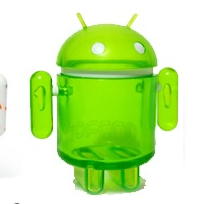
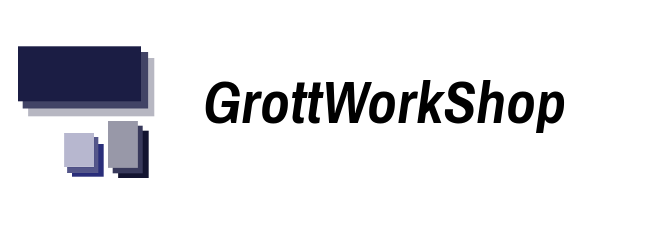

GreenAndroid
============

A Material library for Android Native java App development.

# Credits

Modules:

Materialize: [Materialize by Mike Penz]()

# Developed By

Created by [Fred Grott](http://shareme.github.com).

# License

Apache 2.0 License
